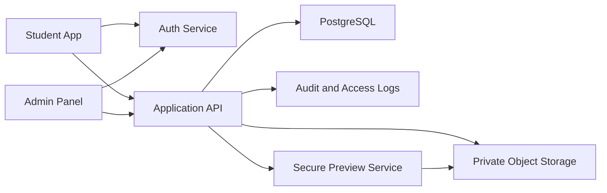

# Secure Learning App Implementation Plan

## 1. Recommended Technical Stack

Recommended first version:

- Frontend: Next.js with TypeScript.
- Styling: Tailwind CSS or a component system built on Radix UI/shadcn patterns.
- Backend: Next.js API routes or NestJS if the backend will grow independently.
- Database: PostgreSQL.
- ORM: Prisma or Drizzle.
- Auth: Auth.js, Clerk, Supabase Auth, or custom JWT/session auth with strong controls.
- File storage: Private S3-compatible storage such as AWS S3, Cloudflare R2, or Supabase Storage with private buckets.
- PDF preview: PDF.js rendered page-by-page inside a custom viewer.
- Audio preview: authenticated streaming endpoint.
- Admin dashboard: protected web routes with role-based access control.
- Deployment: Vercel/Cloudflare for frontend, managed Postgres, private object storage.

Security-focused alternative:

- Backend: NestJS or Fastify API service.
- Frontend: Next.js.
- Auth/session service separated from content delivery.
- Object storage with signed URLs and short expiry.
- CDN only for authorized signed content, never public files.

## 2. Architecture Overview



Key architecture rules:

- The frontend never stores or exposes permanent file URLs.
- The backend is the source of truth for access decisions.
- Every material preview request creates an access log.
- Signed URLs must expire quickly.
- Admin APIs and student APIs must be clearly separated.
- Content metadata and file storage paths must be separate.

## 3. Development Phases

### Phase 0: Product and Foundation

Goal:

Finalize product scope, security rules, stack, and design direction.

Tasks:

- Confirm web-first or mobile-first delivery.
- Finalize subscription rules for Free, Pro, Premium.
- Define admin roles.
- Finalize data model.
- Create wireframes for student dashboard, admin dashboard, and secure viewer.
- Set up repository, linting, formatting, environment handling, and CI.

Deliverables:

- PRD.
- Data schema draft.
- Security model.
- UX direction.
- Development environment.

### Phase 1: Authentication and Approval

Goal:

Create secure account lifecycle.

Tasks:

- Build signup form with name, email, phone, address, and password.
- Add validation for email and phone.
- Add password hashing if using custom auth.
- Add email verification if supported.
- Create user statuses.
- Add admin login.
- Add protected route middleware.
- Add pending approval screen.
- Add admin user approval queue.
- Add approve, reject, and suspend actions.
- Log all admin approval actions.

Deliverables:

- Student registration.
- Student login status gates.
- Admin approval workflow.
- Audit logs.

### Phase 2: Admin Content Management

Goal:

Allow admins to create and organize study materials.

Tasks:

- Build course, subject, chapter, topic CRUD.
- Build material metadata form.
- Build file upload workflow for PDFs, images, and audio.
- Store uploaded files in private storage.
- Add material status: draft, published, archived.
- Add material access level: Free, Pro, Premium.
- Add admin search and filters.
- Add confirmation modals for archive/delete.
- Log upload, publish, unpublish, and delete actions.

Deliverables:

- Admin content library.
- Private upload pipeline.
- Structured study material organization.

### Phase 3: Student Dashboard and Content Access

Goal:

Create the student learning experience.

Tasks:

- Build student dashboard.
- Show accessible courses and materials based on status and subscription.
- Add locked states for unavailable plan content.
- Add course/subject/chapter navigation.
- Add recently viewed materials.
- Add bookmarks.
- Add in-app notifications.
- Add access logging for material opens.

Deliverables:

- Student dashboard.
- Structured material browsing.
- Plan-based access control.

### Phase 4: Secure Preview Layer

Goal:

Prevent direct file exposure and discourage copying.

Tasks:

- Build secure material preview API.
- Validate authorization on every preview request.
- Generate short-lived signed file access.
- Render PDFs using PDF.js without download/print controls.
- Add visible dynamic watermark to PDFs and images.
- Add session watermark fields: name, phone/email, timestamp, session ID.
- Add audio streaming endpoint.
- Add rate limits to preview APIs.
- Disable simple right-click and save/print shortcuts inside viewer.
- Log every preview event.

Deliverables:

- Secure PDF viewer.
- Secure image viewer.
- Secure audio player.
- Watermarked preview experience.
- Access logs.

### Phase 5: Subscription Management

Goal:

Support Free, Pro, and Premium access rules.

Tasks:

- Create plan management table.
- Add admin manual plan assignment.
- Add start date and expiry date.
- Add subscription status: active, expired, cancelled.
- Add student subscription status display.
- Add expiry notifications.
- Add plan-based material filtering.

Deliverables:

- Manual subscription control.
- Plan-based access enforcement.
- Student subscription visibility.

### Phase 6: Security Hardening

Goal:

Move from functional security to production-grade controls.

Tasks:

- Add rate limiting.
- Add bot and brute-force protection.
- Add admin 2FA.
- Add session rotation and revoke session support.
- Add concurrent session limits.
- Add suspicious activity detection.
- Add device/session management page.
- Add security event dashboard.
- Add backup and restore process.
- Add vulnerability scanning in CI.
- Add dependency update monitoring.

Deliverables:

- Hardened authentication.
- Hardened admin panel.
- Security monitoring.
- Operational readiness.

### Phase 7: Payments and Growth

Goal:

Add monetization and growth features after secure MVP.

Tasks:

- Integrate payment gateway.
- Add checkout.
- Add subscription renewal.
- Add invoice history.
- Add coupon support.
- Add referral support if needed.
- Add analytics dashboards.
- Add WhatsApp/SMS notifications if needed.

Deliverables:

- Paid subscriptions.
- Automated plan activation.
- Growth analytics.

## 4. Suggested Folder Structure

```text
src/
  app/
    (auth)/
    (student)/
    admin/
    api/
  components/
    admin/
    student/
    secure-viewer/
    ui/
  lib/
    auth/
    db/
    storage/
    security/
    subscriptions/
  server/
    access-control/
    audit/
    content/
    users/
  styles/
prisma/
  schema.prisma
docs/
  PRODUCT_REQUIREMENTS.md
  IMPLEMENTATION_PLAN.md
  SECURITY_MODEL.md
```

## 5. Database Tables

Recommended MVP tables:

- `users`
- `student_profiles`
- `admin_profiles`
- `approval_requests`
- `subscription_plans`
- `student_subscriptions`
- `courses`
- `subjects`
- `chapters`
- `topics`
- `materials`
- `material_files`
- `material_access_logs`
- `admin_audit_logs`
- `device_sessions`
- `notifications`

## 6. API Modules

Auth:

- `POST /api/auth/signup`
- `POST /api/auth/login`
- `POST /api/auth/logout`
- `GET /api/auth/me`

Admin users:

- `GET /api/admin/users`
- `POST /api/admin/users/:id/approve`
- `POST /api/admin/users/:id/reject`
- `POST /api/admin/users/:id/suspend`

Admin content:

- `POST /api/admin/materials`
- `GET /api/admin/materials`
- `PATCH /api/admin/materials/:id`
- `POST /api/admin/materials/:id/publish`
- `POST /api/admin/uploads/sign`

Student content:

- `GET /api/student/dashboard`
- `GET /api/student/courses`
- `GET /api/student/materials`
- `GET /api/student/materials/:id`
- `POST /api/student/materials/:id/bookmark`

Secure preview:

- `POST /api/preview/materials/:id/session`
- `GET /api/preview/materials/:id/page/:pageNumber`
- `GET /api/preview/materials/:id/image`
- `GET /api/preview/materials/:id/audio`

Subscriptions:

- `GET /api/student/subscription`
- `POST /api/admin/users/:id/subscription`
- `GET /api/admin/subscriptions`

## 7. Access Control Policy

Every protected request should call one shared policy function.

Required checks:

1. User exists.
2. User is authenticated.
3. User is approved.
4. User is not suspended.
5. Subscription is active if material requires it.
6. Plan rank is high enough for material access.
7. Course or batch assignment allows access.
8. Request is within rate limits.
9. Preview session is valid if accessing file data.

## 8. UI Implementation Notes

Student dashboard:

- Left navigation on desktop.
- Bottom navigation or compact top navigation on mobile.
- Clear course progress and material sections.
- Locked content should show plan requirement without exposing file details.
- Viewer should feel like a native reader, not a browser iframe.

Admin panel:

- Dense tables with filters.
- Clear status chips.
- Bulk operations where useful.
- Upload forms with metadata and access level in one flow.
- Audit log links from user and material detail pages.

Design style:

- Neutral background.
- Strong typography.
- Minimal shadows.
- Thin borders.
- Accent color used for active states and primary actions only.
- Avoid large decorative gradients.

## 9. Testing Plan

Unit tests:

- Access policy logic.
- Subscription plan comparison.
- User status gates.
- File preview permission checks.
- Audit log creation.

Integration tests:

- Signup to pending approval.
- Pending user cannot access dashboard.
- Approved user can access dashboard.
- Free user cannot access Pro/Premium material.
- Pro user cannot access Premium material.
- Suspended user cannot access anything protected.
- Admin upload creates private material file.

End-to-end tests:

- Student signup flow.
- Admin approval flow.
- Admin upload and publish flow.
- Student preview flow.
- Locked content state.

Security tests:

- Direct file URL access fails.
- Expired signed URL fails.
- Unauthorized material ID fails.
- Rate limits trigger correctly.
- Admin routes reject student users.
- Preview endpoints require active session.

## 10. Deployment Plan

Development:

- Local app.
- Local or hosted Postgres.
- Private test bucket.

Staging:

- Separate database.
- Separate storage bucket.
- Seeded admin account.
- Test student accounts for each plan.

Production:

- Managed database backups.
- Private object storage.
- Environment variable management.
- Error monitoring.
- Security alerts.
- Admin 2FA enabled.
- TLS everywhere.

## 11. MVP Milestones

Milestone 1:

- Project setup, database schema, auth, signup, login.

Milestone 2:

- Admin approval panel and protected student dashboard.

Milestone 3:

- Admin content organization and private uploads.

Milestone 4:

- Secure PDF/image/audio preview with watermarking.

Milestone 5:

- Subscription assignment and plan-based access.

Milestone 6:

- Security hardening, tests, staging deployment.

## 12. Risks and Mitigations

Risk: Users bypass browser restrictions.

Mitigation:

- Do not rely only on disabling browser controls.
- Use private storage, short-lived URLs, watermarking, logs, and revocation.

Risk: Admin account compromise.

Mitigation:

- Require strong passwords, 2FA, audit logs, and least-privilege roles.

Risk: Public file leakage.

Mitigation:

- Never put study materials in public storage.
- Avoid permanent file URLs.
- Enforce server-side checks before signing or streaming.

Risk: App becomes slow with large PDFs.

Mitigation:

- Render page-by-page.
- Cache thumbnails where safe.
- Stream content.
- Avoid loading entire files on dashboard pages.

Risk: Subscription rules become messy.

Mitigation:

- Centralize access policy.
- Keep plan definitions in database.
- Test all plan combinations.
